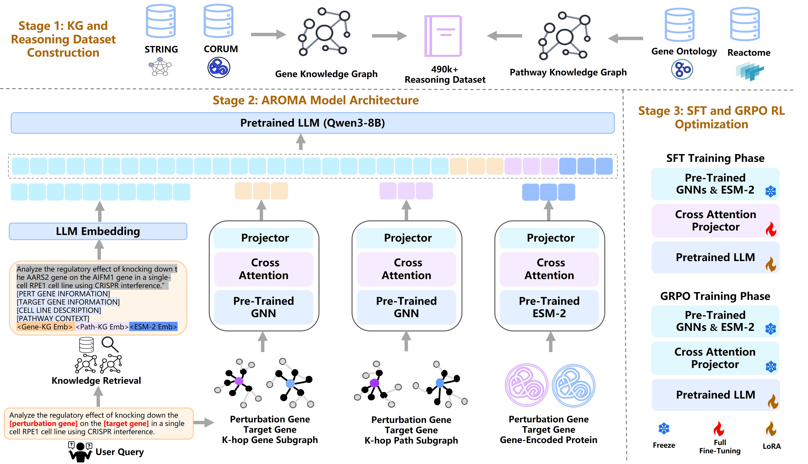

<p align="center">
  
</p>

<h2 align="center"> 🧬 AROMA: Augmented Reasoning Over a Multimodal Architecture for Virtual Cell Genetic Perturbation Modeling </h2>

<p align="center">
  📃 <a href="https://huggingface.co/blazerye/AROMA" target="_blank">Paper</a> • 🤗 <a href="https://huggingface.co/blazerye/AROMA" target="_blank">Model</a> • 🗂️ <a href="https://huggingface.co/blazerye/PerturbReason" target="_blank">Datasets</a><br>
</p>
</p>

## 📌 Contents
- [Overview](#overview)
- [Quick Start](#quick_start)
- [Model Weights](#model_weights)
- [Datasets](#datasets)
- [Citation](#citation)

## 🌐 Overview

AROMA is a novel multimodal architecture for virtual cell modeling that integrates textual evidence, graph topology, and protein sequences to predict the effects of genetic perturbations.

<p align="center">
  
</p>

The overall AROMA pipeline is illustrated in the figure above and is divided into three stages:

- **Data stage.** AROMA constructs two complementary knowledge graphs and a large-scale virtual cell reasoning dataset for evidence grounding.  

- **Modeling stage.** AROMA adopts a retrieval-augmented strategy to incorporate query-relevant information, thereby providing explicit evidence cues for prediction. In addition, it jointly leverages topological representations learned from graph neural networks (GNN) and protein sequence representations encoded by ESM-2, and applies a cross-attention module to explicitly model perturbation-target gene dependencies across modalities.  

- **Training stage.** AROMA first performs multimodal supervised fine-tuning (SFT), and is then further optimized with Group Relative Policy Optimization (GRPO) reinforcement learning to enhance predictive performance while generating biologically meaningful explanations.


## 🚀 Quick Start

### Environment Setup

Install the necessary dependencies:

```bash
cd AROMA
# Install requirements
pip install -r requirements.txt
```

### Knowledge Graph Preprocessing
AROMA utilizes Graph Neural Networks to extract topological features from biological knowledge graphs. This process is divided into two parts: Gene-KG and Path-KG.

🧬 Gene Knowledge Graph

```bash
cd gnn
# Pretraining
python gnn_pretrain_gene_graph.py
# Inference
python gnn_inference_gene_graph.py
```

🗺 Pathway Knowledge Graph

```bash
cd gnn
# Pretraining
python gnn_pretrain_pathway_graph.py
# Inference (Extracting embeddings)
python gnn_inference_pathway_graph.py
```
### AROMA Model Training
The training process follows a two-stage optimization strategy.

Stage 1: Multimodal Supervised Fine-Tuning
```bash
cd aroma
CUDA_VISIBLE_DEVICES=0,1,2,3,4,5,6,7 \
deepspeed --num_gpus 8 train_sft.py
```

Stage 2: GRPO Reinforcement Learning
```bash
cd aroma
CUDA_VISIBLE_DEVICES=0,1,2,3,4,5,6,7 \
accelerate launch --multi_gpu --num_processes 8 train_grpo.py
```
### Inference & Evaluation

```bash
cd aroma
python inference.py
```

## 🤗 Model Weights
The pretrained AROMA model checkpoints have been released on Hugging Face at [blazerye/AROMA](https://huggingface.co/blazerye/AROMA). The weights can be directly used for inference or fine-tuning on downstream virtual-cell perturbation modeling tasks.

## 🗂️ Datasets
- **Gene-KG and Path-KG.** We release the complete versions of Gene-KG and Path-KG in this repository to support running our codebase and facilitate downstream research. 
- **PerturbReason.** For the PerturbReason dataset, only a 1,000-sample subset is publicly released in this repository for demonstration and verification purposes. The full PerturbReason dataset is available at [blazerye/PerturbReason](https://huggingface.co/blazerye/PerturbReason).

## 📌 Citation
If you find AROMA useful for your research and applications, please cite using this BibTeX:
```bibtex
@inproceedings{wang2026aroma,
    title="{AROMA}: Augmented Reasoning Over a Multimodal Architecture for Virtual Cell Genetic Perturbation Modeling",
    author="Wang, Zhenyu and Ye, Geyan and Liu, Wei and Ng, Man Tat Alexander",
    booktitle="Findings of the Association for Computational Linguistics: ACL 2026",
    year="2026",
    publisher="Association for Computational Linguistics"
}
```